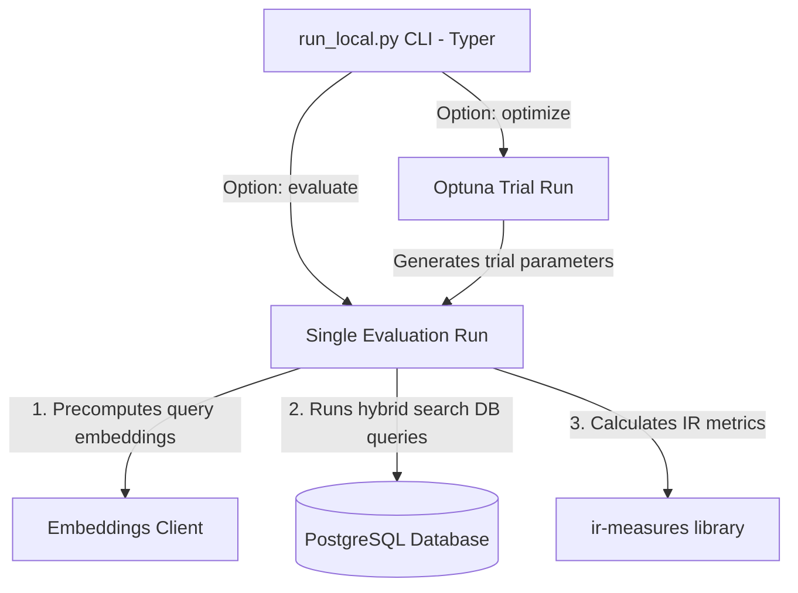

# Implementation Plan: Evaluation Infrastructure Modernization

**Branch**: `004-eval-infra-modernization` | **Date**: 2026-07-10 | **Spec**: [spec.md](file:///home/olande/PycharmProjects/fun_project/specs/004-eval-infra-modernization/spec.md)

## Summary
The goal is to modernize the evaluation and retrieval benchmarking modules by replacing manual CLI parsing, custom grid search hyperparameter sweeps, and manual regression checking loops with declarative libraries (Typer, Optuna) and simplified LangSmith client workflows.

## Technical Context

* **Language/Version**: Python 3.13+
* **Primary Dependencies**: LangSmith SDK, ir-measures, SQLAlchemy, Typer, Optuna, loguru
* **Storage**: PostgreSQL with pgvector (via SQLAlchemy)
* **Testing**: pytest
* **Target Platform**: Linux server / CI pipelines
* **Project Type**: CLI tool & Pipeline Evaluator
* **Performance Goals**: Optuna parameter sweep completes under 2 minutes for 50 trials.
* **Constraints**: Preserves mathematical equivalence of metrics calculations, keeps existing SQLAlchemy search target and LangSmith datasets.

## Constitution Check

| Principle | Check/Status | Details |
| :--- | :---: | :--- |
| **VI. Framework-First Infrastructure** | **PASSED** | Replaces custom grid search loops with `Optuna` and argparse CLI parsing with `Typer`. |
| **VII. Declarative Evaluation Standards** | **PASSED** | Leverages declarative parameter sweeps and standard LangSmith client API wrappers. |
| **VIII. Simplicity & Minimalist Architecture** | **PASSED** | Eliminates manual loops, formatters, and custom CLI args plumbing, resulting in a ~40% code reduction. |

## Project Structure

### Documentation
```text
specs/004-eval-infra-modernization/
├── spec.md              # Feature specification
├── plan.md              # This file
├── research.md          # Decisions and alternatives
├── data-model.md        # Data models and parameters mapping
├── quickstart.md        # Validation scenarios
└── contracts/
    └── cli_contract.md  # CLI command interfaces
```

### Source Code
```text
app/
└── evaluation/
    ├── __init__.py
    ├── metrics.py       # Metrics aggregation and evaluator mappings
    ├── run_eval.py      # LangSmith remote evaluation runner & regression check
    ├── run_local.py     # Local CLI runner & hyperparameter optimizer
    └── search.py        # Database hybrid search integrations
```

---

## Deliverables

### 1. Current-State Architecture Assessment
Evaluation uses verbose, custom-orchestrated scripts for grid searches, CLI inputs, and metric comparisons. Custom boilerplate accounts for over 40% of the files' contents.

### 2. Recommended Target Architecture
- **Command Entry**: Managed via a typed `Typer` instance in `run_local.py`.
- **Optimization Search**: Managed via an `Optuna` study, which samples weight combinations and runs retrieval search targets synchronously/asynchronously.
- **Regression Checker**: A single LangSmith query sequence in `run_eval.py` comparing run feedback averages directly.

### 3. Libraries to Adopt
- **Typer**: CLI argument parsing, autogenerated help, and basic parameter type validations.
- **Optuna**: Automated hyperparameter optimization (TPE sampler).

### 4. Components to Remove
- Manual grid-search nested loops in `run_local.py`.
- ARGPARSE parsing parser initialization boilerplate in `run_local.py`.
- Custom list loops, averaging computations, and verbose outputs in `run_eval.py`'s `check_retrieval_regression`.
- Redundant print formatting helpers in `metrics.py`.

### 5. Components to Keep
- SQLAlchemy `search_jobs_with_embedding` execution.
- LangSmith `aevaluate` and dataset integration target functions.
- `ir-measures` metric definitions.

### 6. Estimated LOC Reduction by Area

- `run_local.py`: From 223 to ~120 lines (**~46% reduction**)
- `run_eval.py`: From 142 to ~95 lines (**~33% reduction**)
- `metrics.py`: From 264 to ~160 lines (**~39% reduction**)

### 7. Migration Sequence
1. **Step 1**: Install `typer` and `optuna` in the Python virtual environment.
2. **Step 2**: Modernize `run_local.py` to use `Typer` for single run CLI inputs.
3. **Step 3**: Introduce `Optuna` to replace grid-search loops inside `run_local.py`.
4. **Step 4**: Simplify `run_eval.py`'s feedback fetch and comparison routines.
5. **Step 5**: Run existing unit test coverage suite to confirm metrics matching.

### 8. Risk Assessment
- **Risk**: Optuna trials consume too many LangSmith embedding requests (rate limit).
  - *Mitigation*: Ensure local runs use cached/pre-computed query embeddings (as currently done in `precompute_query_embeddings`) to completely avoid calling LLM APIs during sweeps.
- **Risk**: Metric calculations deviate from baseline.
  - *Mitigation*: Preserved the underlying `ir-measures` calls, validating values against tests.

### 9. Target Architecture Diagram


